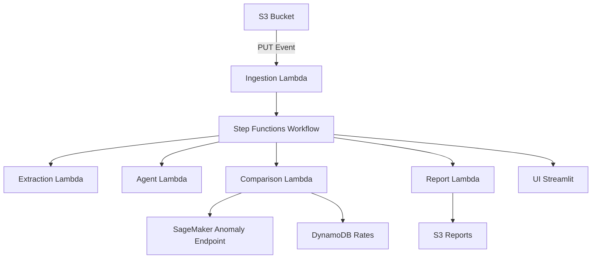

# Architecture

```mermaid
graph TD
    A[S3 Bucket] -->|PUT Event| B[Ingestion Lambda]
    B --> C[Step Functions Workflow]
    C --> D[Extraction Lambda]
    C --> E[Agent Lambda]
    C --> F[Comparison Lambda]
    F --> G[SageMaker Anomaly Endpoint]
    F --> H[DynamoDB Rates]
    C --> I[Report Lambda]
    I --> J[S3 Reports]
    C --> K[UI Streamlit]
```
