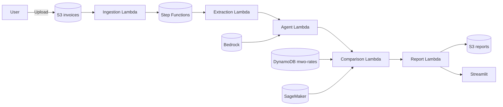

# Architecture

```mermaid
flowchart LR
  U[User] -->|Upload| S3[(S3 invoices)]
  S3 --> ING[Ingestion Lambda]
  ING --> SFN[(Step Functions)]
  SFN --> EXT[Extraction Lambda]
  EXT --> AGT[Agent Lambda]
  AGT --> CMP[Comparison Lambda]
  CMP --> RPT[Report Lambda]
  DDB[(DynamoDB mwo-rates)] --> CMP
  SM[(SageMaker)] --> CMP
  BDR[(Bedrock)] --> AGT
  RPT --> S3R[(S3 reports)]
  RPT --> UI[Streamlit]
```
